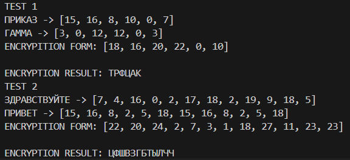

---
## Front matter
title: "Отчёт по лабораторной работе № 3"
author: "Нирдоши Всеволод Раджендер"

## Generic otions
lang: ru-RU
toc-title: "Шифрование методом гаммирования"

## Bibliography
bibliography: bib/cite.bib
csl: pandoc/csl/gost-r-7-0-5-2008-numeric.csl

## Pdf output format
toc: true # Table of contents
toc-depth: 2
lof: true # List of figures
lot: true # List of tables
fontsize: 12pt
linestretch: 1.5
papersize: a4
documentclass: scrreprt
## I18n polyglossia
polyglossia-lang:
  name: russian
  options:
  - spelling=modern
  - babelshorthands=true
polyglossia-otherlangs:
  name: english
## I18n babel
babel-lang: russian
babel-otherlangs: english
## Fonts
mainfont: IBM Plex Serif
romanfont: IBM Plex Serif
sansfont: IBM Plex Sans
monofont: IBM Plex Mono
mathfont: STIX Two Math
mainfontoptions: Ligatures=Common,Ligatures=TeX,Scale=0.94
romanfontoptions: Ligatures=Common,Ligatures=TeX,Scale=0.94
sansfontoptions: Ligatures=Common,Ligatures=TeX,Scale=MatchLowercase,Scale=0.94
monofontoptions: Scale=MatchLowercase,Scale=0.94,FakeStretch=0.9
mathfontoptions:
## Biblatex
biblatex: true
biblio-style: "gost-numeric"
biblatexoptions:
  - parentracker=true
  - backend=biber
  - hyperref=auto
  - language=auto
  - autolang=other*
  - citestyle=gost-numeric
## Pandoc-crossref LaTeX customization
figureTitle: "Рис."
tableTitle: "Таблица"
listingTitle: "Листинг"
lofTitle: "Список иллюстраций"
lotTitle: "Список таблиц"
lolTitle: "Листинги"
## Misc options
indent: true
header-includes:
  - \usepackage{indentfirst}
  - \usepackage{float} # keep figures where there are in the text
  - \floatplacement{figure}{H} # keep figures where there are in the text
---

## Цель работы

Изучить принцип работы шифрования методом гаммирования, включая генерацию псевдослучайных последовательностей для гаммы и реализацию операции модульного сложения (mod N) для шифрования и дешифрования данных. Понять механизм защиты информации с использованием конечных и бесконечных гамм.

## Задание

1. Реализовать алгоритм шифрования исходного сообщения с использованием метода гаммирования.  
2. Использовать псевдослучайную последовательность в качестве гаммы для шифрования данных.  
3. Провести дешифрование сообщения и убедиться, что восстановленный текст совпадает с исходным.  
4. Проанализировать стойкость шифра и сделать выводы о зависимости стойкости от характеристик гаммы.  

## Выполнение работы

  1. Для шифрования была использована гамма, сгенерированная на основе рекуррентного соотношения γ_i = a⋅γ_(i+1) + b mod m, где параметры  a, b и m заданы согласно условиям задачи.  

    def encrypt(letters_pair: tuple):
                    idx = (letters_pair[0] + letters_pair[1]) % m
                    return idx

  2. Операция модульного сложения была применена к каждому символу сообщения и соответствующему символу гаммы для получения зашифрованного текста. Формула шифрования: c_i = (p_i + k_i) mod N , где  p_i  – это i-й символ исходного сообщения, k_i  – i-й символ гаммы,  N  – количество символов в алфавите.  

        message_cleared = list(filter(lambda s: s.lower() in alphabet, message))
        gamma_cleared = list(filter(lambda s: s.lower() in alphabet, gamma))

        message_ind = list(map(lambda s: alphabet.index(s.lower()), message_cleared))
        gamma_ind = list(map(lambda s: alphabet.index(s.lower()), gamma_cleared))

        for i in range(len(message_ind) - len (gamma_ind)):
            gamma_ind.append(gamma_ind[i % len(gamma_ind)])
        
        print(f'{message.upper()} -> {message_ind}')
        print(f'{gamma.upper()} -> {gamma_ind}')

        encrypted_ind = list(map(lambda s: encrypt(s), zip(message_ind, gamma_ind)))

        print(f'ENCRYPITION FORM: {encrypted_ind}\n')

        return ''.join(list(map(lambda s: alphabet[s],encrypted_ind))).upper()  

  3. В ходе работы были проведены эксперименты с различными значениями параметров гаммы для проверки влияния длины и равномерности гаммы на стойкость шифра.

    def test_encryption(message: str, gamma: str):
      print(f'ENCRYPTION RESULT: {gamma_encryption(message, gamma)}')

    def main():
      message = "приказ"
      gamma = "гамма"
      print("TEST 1")
      test_encryption(message, gamma)

      message = "здравствуйте"
      gamma = "привет"
      print("TEST 2")
      test_encryption(message, gamma)

    if __name__ == "__main__":
      main()

   

## Выводы

В ходе лабораторной работы были изучены принципы шифрования методом гаммирования. Полученные результаты показали, что стойкость шифра напрямую зависит от длины гаммы и её равномерности. При использовании псевдослучайной последовательности генератора гаммы шифр становится устойчивым к криптоанализу, но в случае периодичности гаммы возможно упрощение расшифровки. Таким образом, для достижения максимальной стойкости шифрования необходимо выбирать параметры генерации гаммы так, чтобы она была как можно более случайной и непредсказуемой.
