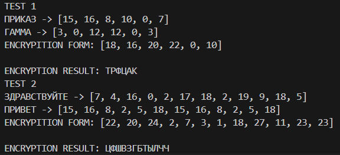

---
## Front matter
lang: ru-RU
title: Отчёт по лабораторной работе № 3
author: Нирдоши Всеволод Раджендер
institute: 
    - РУДН, Москва, Россия

date: 
    - 12 Октября 2024

## Formatting
## i18n babel
babel-lang: russian
babel-otherlangs: english

## Formatting pdf
toc: false
toc-title: Шифрование методом гаммирования
slide_level: 2
aspectratio: 169
section-titles: true
theme: metropolis
header-includes:
 - \metroset{progressbar=frametitle,sectionpage=progressbar,numbering=fraction}

##{:class="img-responsive"}
##{:height="50%" width="50%"}
##{:height="700px" width="400px"}
##{height=25}{width=150}
---

# Лабораторная работа № 3

## Выполнение работы

  1. Для шифрования была использована гамма, сгенерированная на основе рекуррентного соотношения γ_i = a⋅γ_(i+1) + b mod m, где параметры  a, b и m заданы согласно условиям задачи.

      def encrypt(letters_pair: tuple):
                  idx = (letters_pair[0] + letters_pair[1]) % m
                  return idx

---

  2. Операция модульного сложения была применена к каждому символу сообщения и соответствующему символу гаммы для получения зашифрованного текста. Формула шифрования: c_i = (p_i + k_i) mod N , где  p_i  – это i-й символ исходного сообщения, k_i  – i-й символ гаммы,  N  – количество символов в алфавите.

---

        for i in range(len(message_ind) - len (gamma_ind)):
            gamma_ind.append(gamma_ind[i % len(gamma_ind)])
        
        print(f'{message.upper()} -> {message_ind}')
        print(f'{gamma.upper()} -> {gamma_ind}')

        encrypted_ind = list(map(lambda s: encrypt(s), zip(message_ind, gamma_ind)))

        print(f'ENCRYPITION FORM: {encrypted_ind}\n')

        return ''.join(list(map(lambda s: alphabet[s],encrypted_ind))).upper()  
  
---

  3. В ходе работы были проведены эксперименты с различными значениями параметров гаммы для проверки влияния длины и равномерности гаммы на стойкость шифра.

---

    def test_encryption(message: str, gamma: str):
      print(f'ENCRYPTION RESULT: {gamma_encryption(message, gamma)}')

    def main():
      message = "приказ"
      gamma = "гамма"
      print("TEST 1")
      test_encryption(message, gamma)

      message = "здравствуйте"
      gamma = "привет"
      print("TEST 2")
      test_encryption(message, gamma)

---

    if __name__ == "__main__":
      main()

   

## Выводы

В ходе лабораторной работы были изучены принципы шифрования методом гаммирования. Полученные результаты показали, что стойкость шифра напрямую зависит от длины гаммы и её равномерности. При использовании псевдослучайной последовательности генератора гаммы шифр становится устойчивым к криптоанализу, но в случае периодичности гаммы возможно упрощение расшифровки. Таким образом, для достижения максимальной стойкости шифрования необходимо выбирать параметры генерации гаммы так, чтобы она была как можно более случайной и непредсказуемой.

## {.standout}

Спасибо за внимание!
