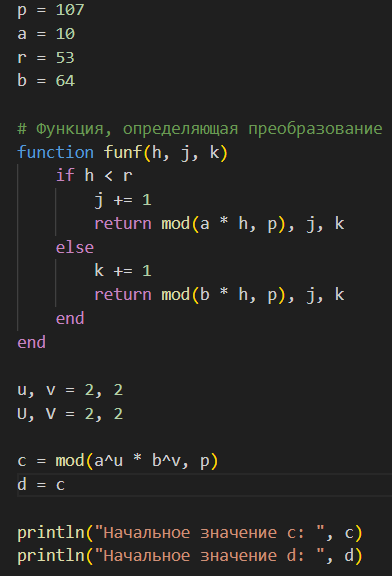
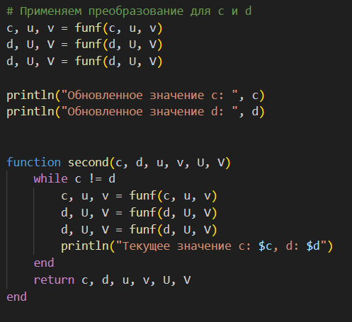
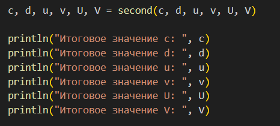
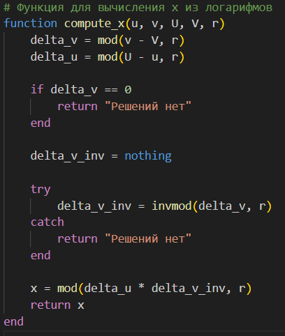
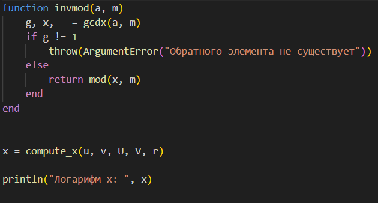
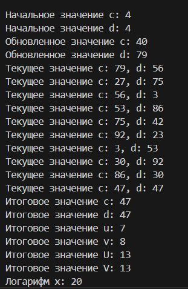

---
## Front matter
lang: ru-RU
title: Математические основы защиты информации и информационной безопасности
author: Нирдоши Всеволод Раджендер
institute: 
    - РУДН, Москва, Россия

date: 
    - 07 Декабря 2024

## Formatting
## i18n babel
babel-lang: russian
babel-otherlangs: english

## Formatting pdf
toc: false
toc-title: Содержание
slide_level: 2
aspectratio: 169
section-titles: true
theme: metropolis
header-includes:
 - \metroset{progressbar=frametitle,sectionpage=progressbar,numbering=fraction}
---

# Лабораторная работа №7

## Цель работы  
Изучение задачи дискретного логарифмирования в конечных полях и алгоритма $p$-метода Полларда для её решения. Реализация алгоритма с использованием языка программирования Julia.

---

## Задачи  

1. Разобраться с основами конечных полей и их свойствами, включая операции сложения, умножения и нахождения обратных элементов.
2. Изучить теоретическую основу $p$-метода Полларда для решения задачи дискретного логарифмирования.
3. Реализовать алгоритм на языке Julia, обеспечивая корректность вычислений на каждом этапе.
4. Проверить работоспособность алгоритма на конкретных данных и проанализировать результаты.  

---

## **Проделанная работа:**

1. **Теоретическая часть:**
   - Изучены основные свойства конечных полей и их применение в криптографии.
   - Разобрана суть задачи дискретного логарифмирования:
     $$
     a^x \equiv b \ (\text{mod} \ p),
     $$
     где $p$ — простое число, $a$ — основание, $b$ — значение, и $x$ — логарифм, который необходимо найти.
   - Изучен алгоритм $p$-метода Полларда, включая использование двух указателей (медленного и быстрого) для обнаружения коллизий.

## **Проделанная работа:**

2. **Практическая часть:**
   - Реализована функция для итеративного обновления значений $c$, $u$, и $v$ в соответствии с определённым случайным отображением:
     - Если $c < r$: обновляется показатель $u$, связанный с основанием $a$.
     - Если $c \geq r$: обновляется показатель $v$, связанный с основанием $b$.
   - Реализован поиск коллизий между двумя указателями (медленным и быстрым).
   - Разработана функция для решения уравнения:
     $$
     \Delta v \cdot x \equiv \Delta u \ (\text{mod} \ r),
     $$
     с использованием вычисления обратного элемента через расширенный алгоритм Евклида.
   - Проведена проверка правильности найденного значения $x$ путём подстановки в исходное уравнение.

## **Проделанная работа:**

3. **Тестирование алгоритма:**
   - Алгоритм протестирован на следующих данных:
    $$
    10^{x} \equiv 64 \ (\text{mod} \ 107),
    $$   
    $$
    a^x \equiv b \ (\text{mod} \ p),
    $$
    $$
    p = 107, \quad a = 10, \quad r = 53, \quad b = 64.
    $$

   - На 11-м шаге обнаружена коллизия, и вычислено значение $x$.

---

## **Скриншоты кода**

{height=160}
{height=160}
{height=70}

## **Скриншоты кода**

{height=210}
{height=120}

---

## **Итог**

{height=290}

---

### **Результаты работы:**
- Значение дискретного логарифма:
  $$
  x = 20 \ (\text{mod} \ 53).
  $$
- Проверка:
  $$
  10^{20} \equiv 64 \ (\text{mod} \ 107),
  $$
  что подтверждает корректность алгоритма.

---

## Выводы  

1. Алгоритм $p$-метода Полларда успешно реализован и протестирован. Он позволяет эффективно находить дискретный логарифм в конечных полях.
2. Вычисленные значения $u, v, U, V$ при коллизии подтверждают корректность обновлений логарифмов в процессе работы алгоритма.
3. Реализация функций для работы с конечными полями, включая нахождение обратных элементов, показала высокую точность и стабильность.
4. Основная сложность заключалась в правильной реализации и проверке каждого шага алгоритма, включая корректность работы с модульной арифметикой.
5. Итоговый результат может быть использован для изучения задач дискретного логарифмирования и в дальнейшем применён в криптографических протоколах. 

---

## {.standout}

Спасибо за внимание!